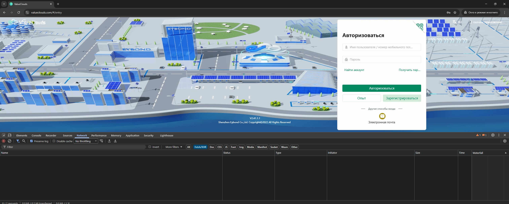
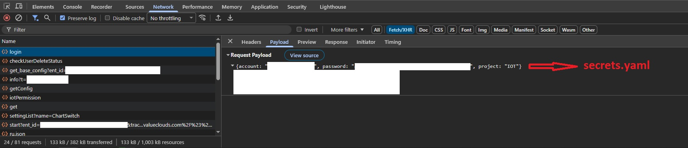
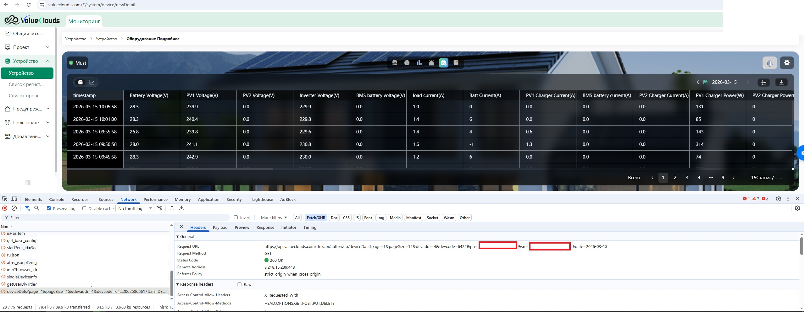
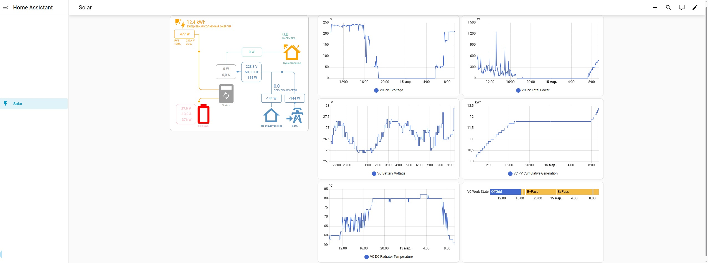

# Integration ValueClouds-Homeassistant for Must PV18-3224 PRO

    Copy configuration.yaml, automations.yaml, templates.yaml, secrets.yaml, sensors.yaml to your homeassistant/
    If file exists: add contents into the end of appropriate files.
    In configuration.yaml dont copy this lines if they exists:
        automation: !include automations.yaml
        template: !include templates.yaml
        sensor: !include sensors.yaml
    Replace in secrets.yaml your_account@gmail.com to your account and **************************************** to your password. It can be taken from dev tools in browser from screenshoot.

    Open https://www.valueclouds.com/#/system/device/newDetail in browser devtools (F12) then click history tab. Copy PN and SN to sensors.yaml instead of PN_HERE ans SN_HERE
    

    Nice view can be added by Sunsynk Power Flow Card in HACS. assets/card.yaml for example:

